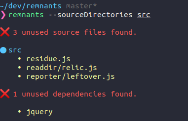

# Remnants [](https://circleci.com/gh/MatthieuLemoine/remnants/tree/master)

Find unused files and dependencies. Spot these residues, leftovers, relics of an ancient past.

And :fire: them. Death to legacy & dead code :skull:

## Is it for me ?

:recycle: Did you recently refactor parts of your awesome project ? ✅

🧓 Is your project so old (more than 2 months old) that you can't even remember why some files & dependencies exist ? ✅

🏭 Is your project so bloated that you're afraid to delete a file ? ✅

**Remnants** find those relics for you so that you can :fire: them in peace.

## Universal

Can be used with webpack, Metro, Rollup (& more) bundled projects but also good old unbundled Node projects.

## Install

```
yarn global add remnants
or
npm i -g remnants
```

## Usage

In your project directory

```
remnants --sourceDirectories src
```

`sourceDirectories` are the folders where you want **Remnants** to look for unused files.

## Example

Running **Remnants** on itself 🤯



:scream: Look at these remnants! :rage:

Let :fire: them all!

...

Done ✅


Yeah no unused files or dependencies :tada:

Thanks **Remnants** !

## Remove unused files

```
remnants --sourceDirectories src --remove
```

## Advance usage

```
remnants --sourceDirectories src --sourceDirectories lib --projectRoot /Users/remnants/dev/awesome-project --exclude **/*@*x.png
```

## Related

If you're looking for a webpack plugin, give [unused-webpack-plugin](https://github.com/MatthieuLemoine/unused-webpack-plugin) a try. #shamelessplug
